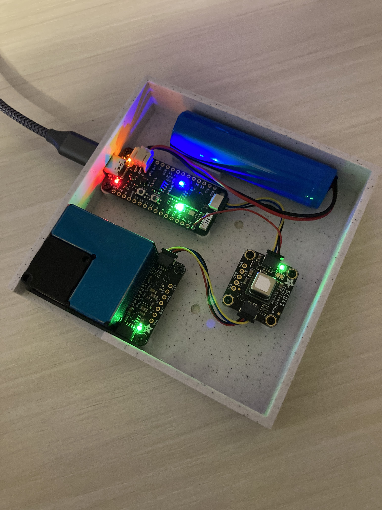

# Breatheesp
This is the uploaded Circuit Python Firmware for an IOT air quality sensor with the [UM Feather S2](https://feathers2.io/) development board. Currently this project is using Circuit Python V6.3.0 with the ESP32-S2 as a proof-of-concept (POC). This code has been ported to a project in C [here](https://github.com/Nat-As/Breatheespc).
<BR>
  <BR>
    
This Project is designed to create an air-quality sensor using the Feather S2 platform as a prototype. A later version will be created in C with custom hardware and software. This code currently connects to the wifi in the secrets file (change it to yours before using) and gets an IP address from the router. All setup is done in order to use the requests module and immedietly begin making API requests. After connecting to the WiFi, the device sends 'mock' data to the database for logging via http POST request. The data is sent in JSON format.
<BR>
Example format:
<BR>
```
        header = {
          'User-Agent': 'Mesh Sensor',
          'Content-Type': 'application/json;charset=UTF-8'}

        payload = {
                'DeviceID': 'Sensor001',
                'Timestamp': time.time(),
                'Temp': '72',
                'Humid': '36'}
  ```
  
# Usage
  ### Setup
  The feather board should have red LED if it cannot connect to the WiFi after turning on. To connect to WiFi, the ```secrets.py``` file must be changed with relevant WiFi information. This includes the Wifi SSID, (The name of the network), and the password, (The password to the network). These are the first two fields in the ```secrets.py``` file as shown below:
  ```
  secrets = {
    'ssid' : '[YourWifiNameHere]',
    'password' : 'password123',
  ```
  ### Server Connection
  Once the device connects to WiFi, the led may turn orange if the server is unreachable. To specify a server to make a post request to, edit the ```server``` varable in the ```code.py``` script. (As shown below)
  ```
  # Configuration
server = "http://www.github.com/Nat-As"
  ```
The example above will send the sensors data to the address: ```http://www.github.com/Nat-As```. This will ideally be changed to the server address of the database.
  
# Components
+ [Feather S2](https://www.adafruit.com/product/4769)
+ [Particulate Matter (PM) Sensor](https://www.adafruit.com/product/4632)
+ [CO2 / Temp / Humidity Sensor](https://www.adafruit.com/product/5190)

# Libraries
Cool Adafruit Libraries [here](https://github.com/adafruit/Adafruit_CircuitPython_Bundle/releases/tag/20211003)
# Examples
Some great [examples](https://learn.adafruit.com/adafruit-metro-esp32-s2/circuitpython-internet-test)
# Troubleshooting
  The device has an onboard RGB led that can have different colors which correspond to different meanings. A table of these colors and their meanings is shown below.
  |Color|Meaning|
  |-----|-------|
  |White|Device is booting|
  |Red|Failed to connect to WiFi|
  |Orange|Failed to send data|
  |Green|All systems go|
  |Rainbow|Default Firmware|
  
# Device
<BR>

<BR>
  
